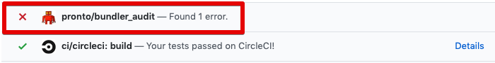

[](https://badge.fury.io/rb/pronto-bundler_audit)
[](https://travis-ci.org/pdobb/pronto-bundler_audit)
[](https://codeclimate.com/github/pdobb/pronto-bundler_audit/maintainability)
[](https://codeclimate.com/github/pdobb/pronto-bundler_audit/test_coverage)

# Pronto::BundlerAudit

Pronto runner for [bundler-audit](https://github.com/rubysec/bundler-audit), patch-level verification for bundler. [What is Pronto?](https://github.com/prontolabs/pronto)

## Installation

Add this line to the `development` group of your application's Gemfile:

```ruby
gem 'pronto-bundler_audit', require: false
```

And then execute:

    $ bundle

Or install it yourself as:

    $ gem install pronto-bundler_audit

## Compatibility

Tested MRI Ruby Versions:
* 2.3
* 2.4
* 2.5
* 2.6
* edge

## Usage

Once installed as a gem, this runner activate automatically when [running Pronto](https://github.com/prontolabs/pronto#usage) -- no configuration is required.

Note: Unlike most Pronto runners, pronto-bundler_audit will always scan Gemfile.lock whenever Pronto is run. That is, this runner does not only run against patches/diffs made on Gemfile.lock. The point is to find issues/advisories on every Pronto run, not just when Gemfile.lock has been updated. Because that wouldn't really help us find vulnerabilities in a project's gems in a timely fashion.

### Examples

#### Local Pronto Run

##### Compact Mode

```bash
$ pronto run -c=master --runner bundler_audit
Running Pronto::BundlerAudit
Gemfile.lock: E: Gem: bootstrap-sass v3.4.0 | Medium Advisory: XSS vulnerability in bootstrap-sass -- CVE-2019-8331 (https://blog.getbootstrap.com/2019/02/13/bootstrap-4-3-1-and-3-4-1/) | Solution: Upgrade to >= 3.4.1.
```

##### Verbose Mode

```bash
$ pronto run -c=master --runner bundler_audit
Running Pronto::BundlerAudit
Gemfile.lock: E: Name: bootstrap-sass
Version: 3.4.0
Advisory: CVE-2019-8331
Criticality: Medium
URL: https://blog.getbootstrap.com/2019/02/13/bootstrap-4-3-1-and-3-4-1/
Title: XSS vulnerability in bootstrap-sass
Solution: Upgrade to >= 3.4.1.
```

#### Github Pull Request - Checks


#### Github Pull Request - Comments

##### Compact Mode


##### Verbose Mode

TODO

## Development

After checking out the repo, run `bin/setup` to install dependencies. Then, run `rake test` to run the tests. You can also run `bin/console` for an interactive prompt that will allow you to experiment.

To install this gem onto your local machine, run `bundle exec rake install`. To release a new version, update the version number in `version.rb`, and then run `bundle exec rake release`, which will create a git tag for the version, push git commits and tags, and push the `.gem` file to [rubygems.org](https://rubygems.org).

## TODO

* Add configuration for compact vs expanded advisories reporting

## Contributing

Bug reports and pull requests are welcome on GitHub at https://github.com/pdobb/pronto-bundler_audit.

## License

The gem is available as open source under the terms of the [MIT License](https://opensource.org/licenses/MIT).
